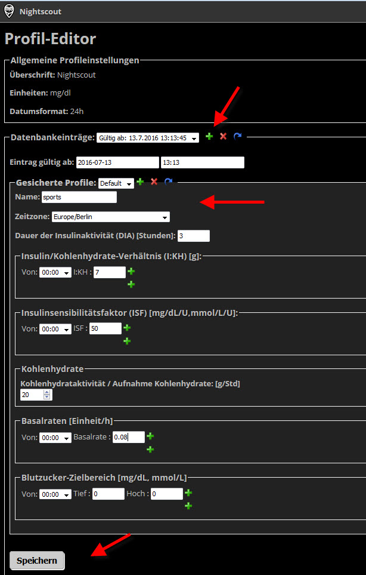

# Profil - Editor

Der Behandlungs Profil Editor speichert angepasste Werte für die persönliche Therapie.Mit dem Profil - Editor konfigurieren wir Einheiten und Werte für die Plugins iob, cob, bwp und Basalraten. 
Über einen eneuen Datenbankeintrag durch Klicken auf das + - Symbol können wir ein alternatives Profil erstellen. Der NS android Client zur Steuerung der Kommunikation zwischen Pumpe und CGM erfragt Werte aus den abgespeicherten Profilen.

**Wichtig:** Ohne Änderugen im Editor werden für die Plugins keine verwendbaren Werte angezeigt.

**Profil Editor:**

Wenn wir die Maus oder den Finger über Fachbegriffe bewegen, werden **Erklärungstexte** in Sprache angezeigt.

Bei **Zeitzone** bitte die entsprechende Zeitzone Einstellen. 

Mit **Dauer der Insulinaktivität (DIA)  in Stunden** definieren wir die Wirkdauer des Bolus - Insulins. Die Plugins iob, bwp  benötigen diese Eingaben.

Mit **Insulin/Kohlenhydrate-Verhältnis (I:KH)  in Gramm** wird angegeben, wieviel Boluseinheiten für eine definierte Menge an KH verwendet werden müssen. Die Plugins iob und cob benötigen diese Eingaben.

Mit dem **Insulinsensibilitätsfaktor (iSF) in mg/dl/U oder mmol/L/U** können wir den Korrekturfaktor in mg/dl oder mmol/L angeben. Mit mehrfachen Eingaben können unterschiedliche Faktoren bestimmt werden. 

Mit **Kohlenhydrataktivität / Aufnahme Kohlenhydrate in Gramm/Stunde** können wir bestimmen, wieviel Gramm Kohlenhydrate pro Stunde verstoffwechselt werden. Das Plugin cob benötigt diese Eingaben.

Mit **Basalraten in Einheiten/Stunde** können wir Basalraten für bestimmte Zeitbereiche eingeben.

Am Ende das **Speichern** nicht vergessen.

Weiter gehts mit der Eingabe von Daten über das [Careportal](../nightscout/care_portal.md).

    
    
    

